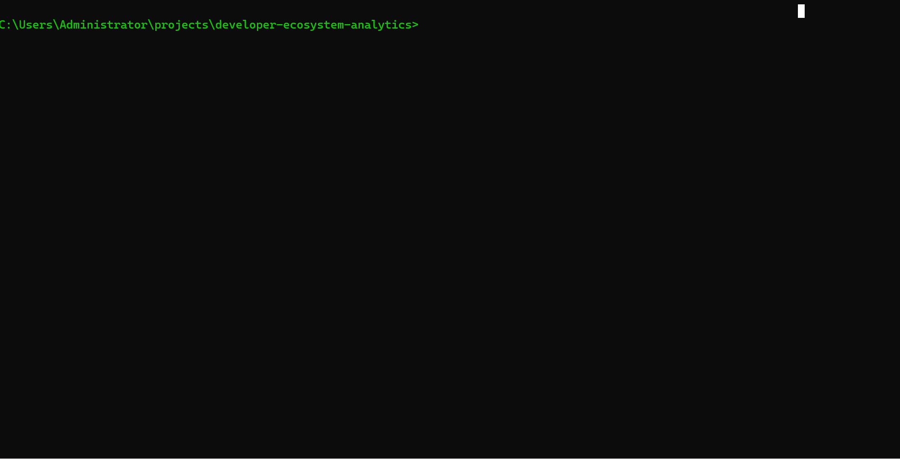

<p align="center">
  >>_LOADING_SCHEMA_[██████████]_100%25;>>>_12_QUERIES_LOADED_::_BASIC_→_ADVANCED;>>>_COMPOSITE_HEALTH_SCORES_READY;>>>_TYPE_PSQL_$DATABASE_URL_..._TO_BEGIN&background=0D1117" alt="Neon Green Postgres Banner" />
</p>

<br>

<p align="center">
  <!-- Glowing Green Badges -->
  
  
  
</p>

##  **`Live Demo`**

<p align="center">
  
</p>

*Running the tech risk assessment query on the stockexchange database.*

# developer-ecosystem-analytics

PostgreSQL workspace for exploring why developer technologies succeed or fail. The repo packages 12 reusable SQL queries that combine community activity, company adoption, and survey sentiment to measure technology momentum and developer experience.

## Repository Layout

```
developer-ecosystem-analytics/
├── README.md
├── LICENSE
├── .gitignore
├── queries/
│   ├── 01_basic/
│   │   ├── query1_top_technologies.sql
│   │   ├── query2_tech_difficulty.sql
│   │   └── query3_monthly_trends.sql
│   ├── 02_intermediate/
│   │   ├── query4_companies_most_tags.sql
│   │   ├── query5_tech_categories.sql
│   │   ├── query6_hardest_per_company.sql
│   │   └── query7_growth_momentum.sql
│   └── 03_advanced/
│       ├── query8_parent_company_analysis.sql
│       ├── query9_tech_health_score.sql
│       ├── query10_question_quality.sql
│       ├── query11_daily_patterns.sql
│       └── query12_company_diversity.sql
├── results/
│   └── sample_outputs.csv
├── docs/
│   ├── schema_diagram.md
│   └── methodology.md
└── scripts/
    └── diagnostic_queries.sql
```

## Data Model (summary)

This project assumes the following core tables (see `docs/schema_diagram.md` for details):

- `technologies`: technology dimension with category, release year, and lifecycle flags.
- `stack_overflow_questions` and `stack_overflow_question_tags`: community activity by tag, score, answers, and closure.
- `developer_sentiment`: survey responses for satisfaction, adoption, and learning curve.
- `companies`: Fortune 500–style company dimension with parent relationships.
- `company_tech_adoption`: declared technology stacks and adoption depth by company.
- `company_question_mentions`: questions attributed or mapped to companies.

## Running the queries

1. Load your data into PostgreSQL following the column names described in `docs/schema_diagram.md`.
2. Execute any query with `psql`:
   ```bash
   psql "$DATABASE_URL" -f queries/01_basic/query1_top_technologies.sql
   ```
3. Copy results into `results/` for sharing or downstream dashboards.

The queries are written in standard PostgreSQL (tested with 14+) and avoid vendor extensions.

## Query Catalog

- Basic: top trending technologies, learning difficulty, monthly adoption trends.
- Intermediate: company tagging volume, category-level rollups, hardest tech per company, and growth momentum scores.
- Advanced: parent-company rollups, composite health scores, question-quality assessment, intraday patterns, and stack diversity by company.

Descriptions and scoring logic are documented inline in each SQL file and expanded in `docs/methodology.md`.

## Diagnostics

Run `scripts/diagnostic_queries.sql` to sanity-check row counts, null density, and reference integrity before running analytics.

## Contributing

Open an issue or PR with suggested tweaks to scoring, additional metrics, or new data sources. Keep SQL portable to PostgreSQL and update the docs when schema changes.

## **`Gist`**
https://gist.github.com/Tony405-spec/82bbd137d85ada850acdffc90c192486
